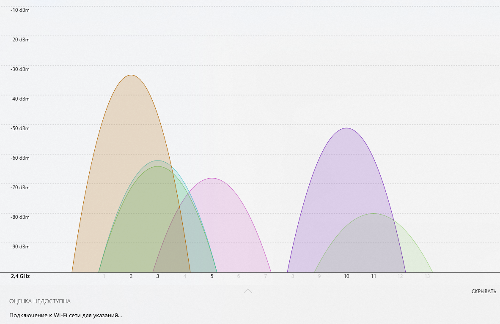
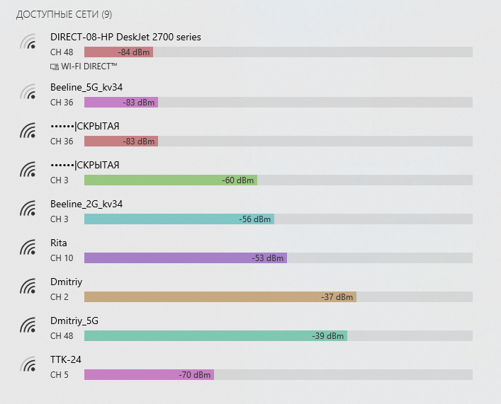

# Лабораторная работа №1

## Анализ сети WiFi. Основы работы

### Цель работы
Установитьанализатор WiFi-сетей.
Познакомиться с основами его работы и произвести перестройку оборудования.

### Теоретическая часть
Wi-Fi сейчас самая популярная технология передачи данных в беспроводных компьютерных сетях.
Название Wi-Fi это торговая марка, которая принадлежит wi-fi alliance.
Техническое описание технологии содержится в стандарте IEEE 802.11.

### Практическая часть

Для анализа используется программа **WiFi Analyzer** Windows.
Она позволяет оценить:
- мощность сигнала;
- используемый канал;
- параметры защиты;
- использование полосы пропускания.

### Задание 1. Установка WiFi Analyzer

Установлено приложение на ПК (Windows – Microsoft Store).  

### Задание 2. Анализ занятости каналов

> 

1. Вижу здесь 6 источников сигнала.

2. Канал 3 в диапазоне 2,422 ГГц оказался самым загруженным.

3. В канале моего роутера только мой роутер. Единственное, что может мешать, так это то, что его сигнал могут немного перекрывать точки доступа с соседних каналов.

### Задание 3. Анализ мощности сигнала

> 

Уровень сигнала на моём рабочем месте оказался равным -37 dBm, что не так уж и плохо. Переместить точку достума нет возможности, так как кабель недостаточно мобилен. Вшешних антен у него тоже нет.
