# Лабораторная работа № 3

## Знакомство и применение сетевых утилит Windows для определения параметров и работоспособности сети

### Цель работы
Получить навыки использования стандартных сетевых утилит ОС Windows.

### Теоретическая часть

В ОС Windows реализован набор консольных утилит для диагностики и мониторинга сети. Они запускаются из командной строки (cmd). Основные из них:  
- hostname – отображает имя компьютера.  
- ipconfig – показывает настройки TCP/IP.  
- net view – выводит список сетевых ресурсов.  
- ping – проверяет доступность узла.  
- netstat – показывает статистику протоколов и текущие подключения.  
- tracert – определяет маршрут до узла.  
- net use – управляет сетевыми подключениями.  
- net send – отправляет сообщения.  
- nslookup – выполняет DNS-запросы.  
- arp – отображает таблицу соответствия IP и MAC-адресов.  
- pathping – комбинирует ping и tracert с расчётом потерь на каждом участке.


## Практическая часть

### 1. Список опций утилиты tracert

```cmd
tracert
```

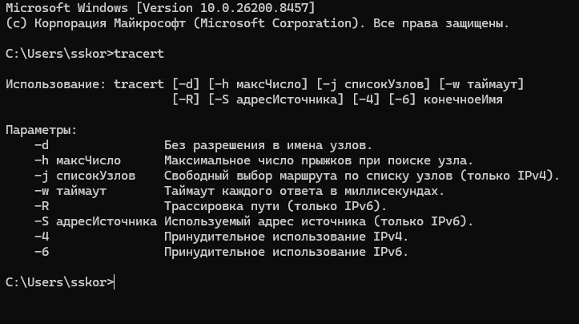

### 2. Выполнение утилит с разным набором опций

#### hostname

```cmd
hostname
```


#### ipconfig

```cmd
ipconfig
ipconfig /all
```

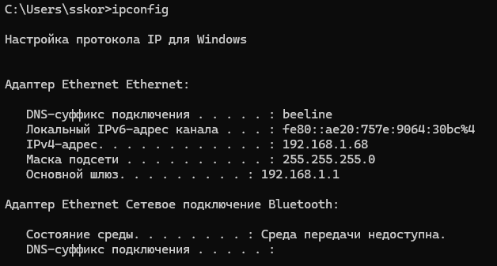
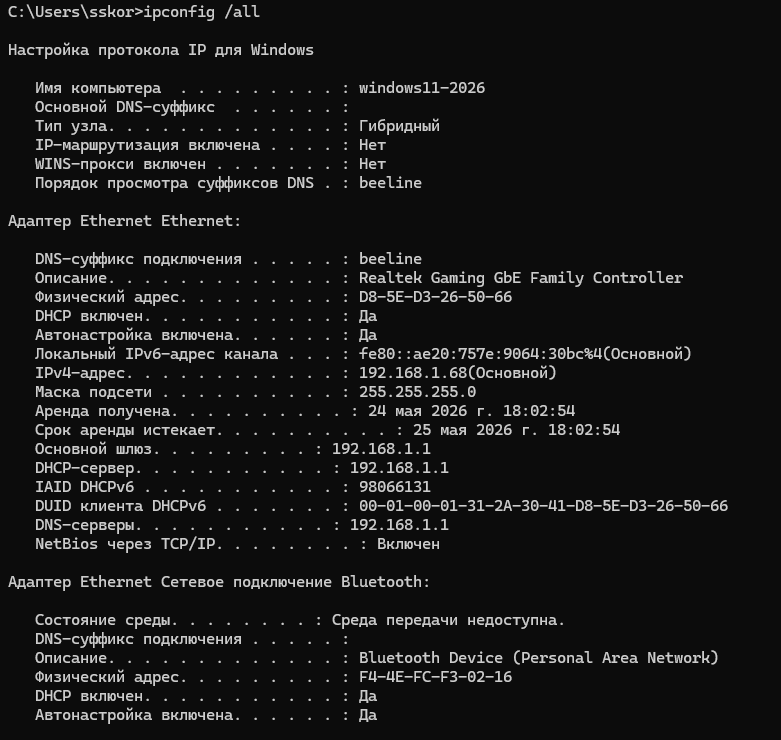

#### net view

```cmd
net view
```

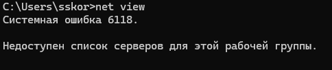

#### ping

```cmd
ping google.com
ping -n 6 -l 100 yandex.ru
```

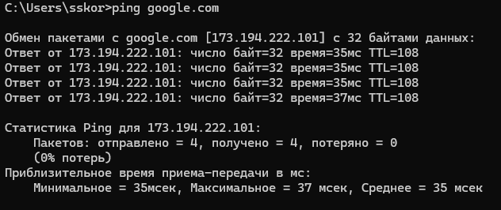
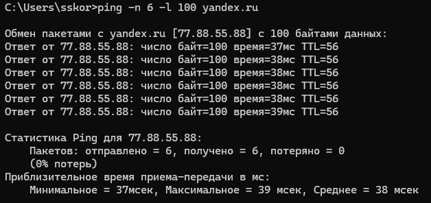

#### netstat

```cmd
netstat -a
netstat -e -s
```

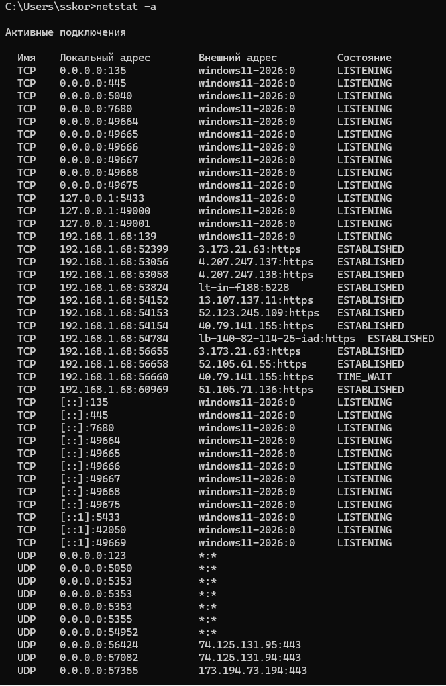
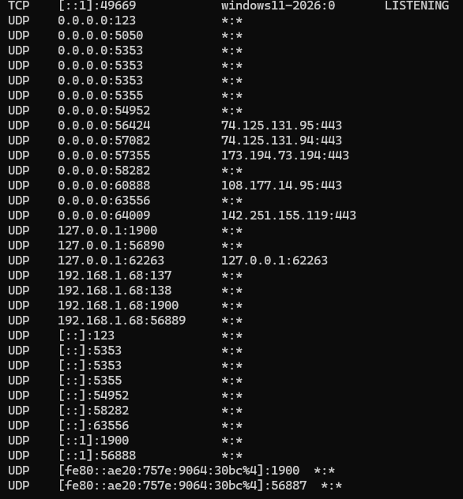
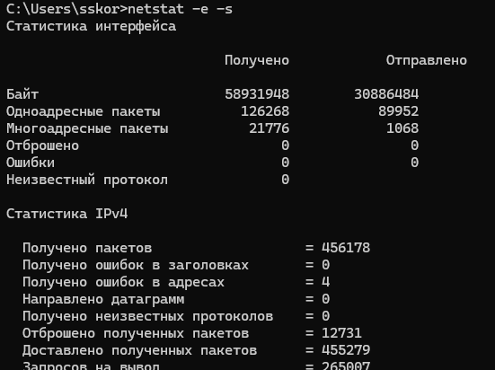

#### tracert

```cmd
tracert ya.ru
```

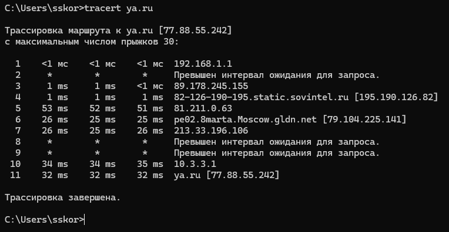

#### net use

```cmd
net use
```

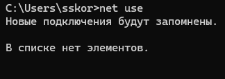

#### net send

```cmd
net send
```

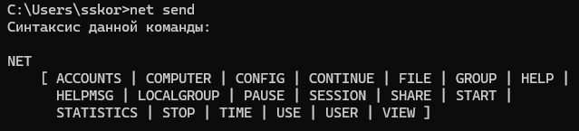

#### nslookup

```cmd
nslookup ya.ru
```

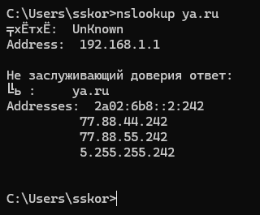

#### arp

```cmd
arp -a
```

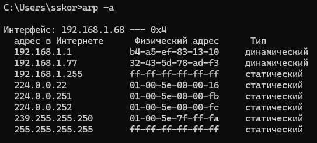

#### pathping

```cmd
pathping ya.ru
```

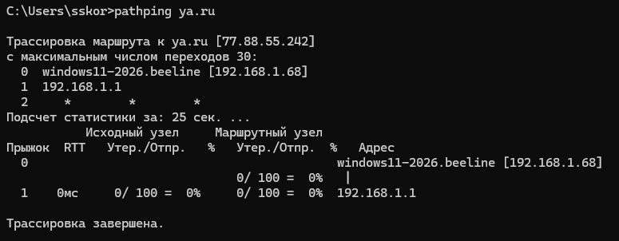

---

### 3. Анализ ipconfig /all

**Вывод команды содержит:**
- Имя компьютера, основной DNS-суффикс.
- Физический адрес (MAC) всех сетевых адаптеров.
- Состояние DHCP, автоконфигурации.
- IPv4-адрес, маску подсети, основной шлюз.

**Дополнительные способы получения аналогичной информации:**  
- Через графический интерфейс: Панель управления → Центр управления сетями → Изменение параметров адаптера → Свойства → Сведения.
- PowerShell: Get-NetIPAddress, Get-NetAdapter, Get-DnsClientServerAddress.

---

### 4. Сравнение pathping с ping и tracert

| Утилита | Что даёт |
|---------|----------|
| ping | Время ответа и % потерь до **конечного** узла, статистика по одному пакету. |
| tracert | Список промежуточных маршрутизаторов с временами отклика. |
| pathping | **Дополнительно** показывает процент потерь на **каждом** промежуточном узле, позволяет выявить проблемные участки (задержки, перегрузки). |

Таким образом, pathping даёт более полную картину качества канала на всём маршруте.

---

### 6. Самые полезные утилиты (субъективное мнение)

| Утилита | Полезность |
|---------|-------------|
| ping | Быстрая проверка доступности сети. |
| ipconfig | Просмотр IP-настроек. |
| tracert | Определение маршрута и поиск разрыва связи. |
