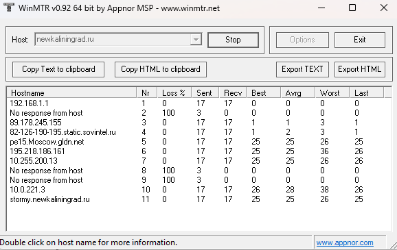
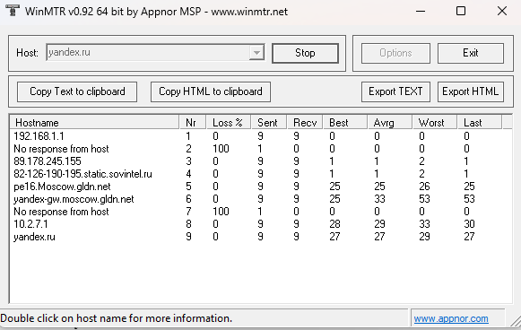
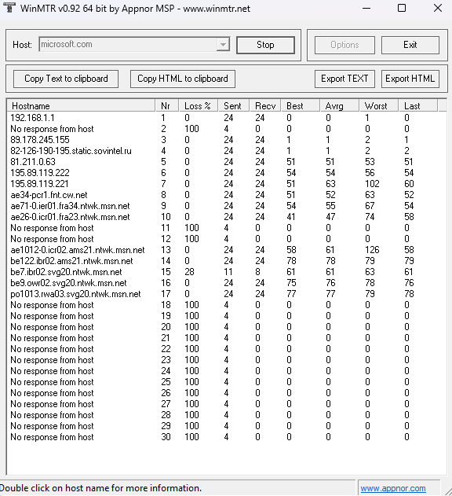

# Лабораторная работа № 4

## Проверка качества  интернет соединения при помощи утилиты WinMTR

### Цель работы
Познакомится с утилитой WinMTR. Научится использовать  утилиту для оценки качества интернет соединения.

### Теоретическая часть

**WinMTR** – это сетевая утилита, которая позволяет получить трассировку маршрута от вашего компьютера до удаленного узла, проверить наличие потерь в канале связи и время отклика каждого, в том числе, и транзитного узла, тем самым вы можете оценить качество канала связи до любой точки в компьютерной сети, поэтому WinMTR часто используют для проверки качества интернет соединения.

## Практическая часть

### Провериить качество интернет-соединения до следующих ресурсов
1) newkaliningrad.ru
2) yandex.ru
3) microsoft.com

> 
> 
> 

### newkaliningrad.ru
|                       Host              -   %  | Sent | Recv | Best | Avrg | Wrst | Last |
|------------------------------------------------|------|------|------|------|------|------|
|                             192.168.1.1 -    0 |   15 |   15 |    0 |    0 |    1 |    1 |
|                   No response from host -  100 |    2 |    0 |    0 |    0 |    0 |    0 |
|                          89.178.245.155 -    0 |   15 |   15 |    1 |    1 |    3 |    2 |
|       82-126-190-195.static.sovintel.ru -    0 |   15 |   15 |    1 |    1 |    3 |    1 |
|                    pe15.Moscow.gldn.net -    0 |   15 |   15 |   25 |   25 |   26 |   26 |
|                         195.218.186.161 -    0 |   15 |   15 |   25 |   25 |   29 |   26 |
|                           10.255.200.13 -    0 |   15 |   15 |   25 |   27 |   43 |   27 |
|                   No response from host -  100 |    2 |    0 |    0 |    0 |    0 |    0 |
|                   No response from host -  100 |    2 |    0 |    0 |    0 |    0 |    0 |
|                              10.0.221.3 -    0 |   15 |   15 |   26 |   27 |   39 |   28 |
|                stormy.newkaliningrad.ru -   10 |   11 |   10 |    0 |   25 |   27 |   27 |
|________________________________________________|______|______|______|______|______|______|
   WinMTR v0.92 GPL V2 by Appnor MSP - Fully Managed Hosting & Cloud Provider

### yandex.ru

|                       Host              -   %  | Sent | Recv | Best | Avrg | Wrst | Last |
|------------------------------------------------|------|------|------|------|------|------|
|                             192.168.1.1 -    0 |   10 |   10 |    0 |    0 |    0 |    0 |
|                   No response from host -  100 |    1 |    0 |    0 |    0 |    0 |    0 |
|                          89.178.245.155 -    0 |   10 |   10 |    1 |    1 |    3 |    1 |
|       82-126-190-195.static.sovintel.ru -    0 |   10 |   10 |    1 |    2 |    3 |    2 |
|                    pe16.Moscow.gldn.net -    0 |   10 |   10 |   26 |   26 |   26 |   26 |
|               yandex-gw.moscow.gldn.net -    0 |   10 |   10 |   25 |   27 |   33 |   26 |
|                   No response from host -  100 |    1 |    0 |    0 |    0 |    0 |    0 |
|                   No response from host -  100 |    1 |    0 |    0 |    0 |    0 |    0 |
|                                10.4.3.1 -    0 |   10 |   10 |   35 |   35 |   36 |   35 |
|                               yandex.ru -    0 |   10 |   10 |   32 |   44 |   95 |   33 |
|________________________________________________|______|______|______|______|______|______|
   WinMTR v0.92 GPL V2 by Appnor MSP - Fully Managed Hosting & Cloud Provider

### microsoft.com

|                       Host              -   %  | Sent | Recv | Best | Avrg | Wrst | Last |
|------------------------------------------------|------|------|------|------|------|------|
|                             192.168.1.1 -    0 |   10 |   10 |    0 |    0 |    1 |    0 |
|                   No response from host -  100 |    1 |    0 |    0 |    0 |    0 |    0 |
|                          89.178.245.155 -    0 |   10 |   10 |    1 |    1 |    3 |    1 |
|       82-126-190-195.static.sovintel.ru -    0 |   10 |   10 |    1 |    1 |    2 |    1 |
|                             81.211.0.63 -    0 |   10 |   10 |   52 |   52 |   54 |   52 |
|                          195.89.119.222 -    0 |   10 |   10 |   54 |   54 |   56 |   55 |
|                          195.89.119.221 -    0 |   10 |   10 |   51 |   53 |   73 |   73 |
|                    ae34-pcr1.fnt.cw.net -    0 |   10 |   10 |   52 |   52 |   55 |   52 |
|         ae71-0.ier01.fra34.ntwk.msn.net -    0 |   10 |   10 |   54 |   57 |   81 |   55 |
|         ae26-0.icr01.fra23.ntwk.msn.net -    0 |   10 |   10 |   42 |   42 |   45 |   42 |
|                   No response from host -  100 |    1 |    0 |    0 |    0 |    0 |    0 |
|                   No response from host -  100 |    1 |    0 |    0 |    0 |    0 |    0 |
|       ae1012-0.icr02.ams21.ntwk.msn.net -    0 |   10 |   10 |   58 |   63 |  108 |   58 |
|          be122.ibr02.ams21.ntwk.msn.net -    0 |   10 |   10 |   78 |   79 |   82 |   79 |
|            be7.ibr02.svg20.ntwk.msn.net -   34 |    3 |    2 |    0 |   62 |   62 |   62 |
|            be9.owr02.svg20.ntwk.msn.net -    0 |   10 |   10 |   76 |   76 |   78 |   78 |
|         po1013.rwa03.svg20.ntwk.msn.net -    0 |   10 |   10 |   78 |   78 |   79 |   78 |
|                   No response from host -  100 |    1 |    0 |    0 |    0 |    0 |    0 |
|                   No response from host -  100 |    1 |    0 |    0 |    0 |    0 |    0 |
|                   No response from host -  100 |    1 |    0 |    0 |    0 |    0 |    0 |
|                   No response from host -  100 |    1 |    0 |    0 |    0 |    0 |    0 |
|                   No response from host -  100 |    1 |    0 |    0 |    0 |    0 |    0 |
|                   No response from host -  100 |    1 |    0 |    0 |    0 |    0 |    0 |
|                   No response from host -  100 |    1 |    0 |    0 |    0 |    0 |    0 |
|                   No response from host -  100 |    1 |    0 |    0 |    0 |    0 |    0 |
|                   No response from host -  100 |    1 |    0 |    0 |    0 |    0 |    0 |
|                   No response from host -  100 |    1 |    0 |    0 |    0 |    0 |    0 |
|                   No response from host -  100 |    1 |    0 |    0 |    0 |    0 |    0 |
|                   No response from host -  100 |    1 |    0 |    0 |    0 |    0 |    0 |
|                   No response from host -  100 |    1 |    0 |    0 |    0 |    0 |    0 |
|________________________________________________|______|______|______|______|______|______|
   WinMTR v0.92 GPL V2 by Appnor MSP - Fully Managed Hosting & Cloud Provider

## Заключение

### 1. newkaliningrad.ru
- **Потери на конечном узле:** 10% (отправлено 11, получено 10)  
- **Время отклика:** Avrg 25 мс  
- **Вывод:** Проблема на стороне сервера или его сети. При хорошем канале провайдера ресурс нестабилен (потери пакетов).

### 2. yandex.ru
- **Потери на конечном узле:** 0%  
- **Время отклика:** Avrg 44 мс (Worst 95 мс — редкий выброс)  
- **Вывод:** Соединение отличное, потерь нет. Небольшие колебания задержки некритичны.

### 3. microsoft.com
- **Потери на последнем отвечающем узле в сети Microsoft:** 0%  
- **Время отклика:** 78 мс  
- **Вывод:** Сам хост microsoft.com не отвечает на ICMP, но пакеты доходят до инфраструктуры Microsoft без потерь. Качество хорошее.