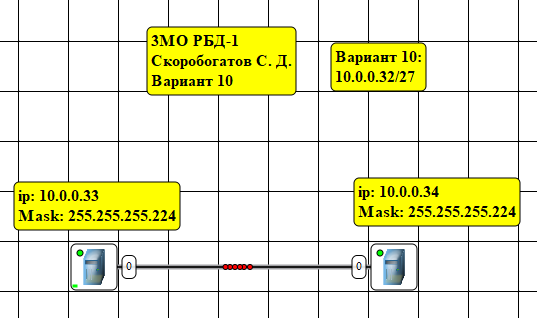
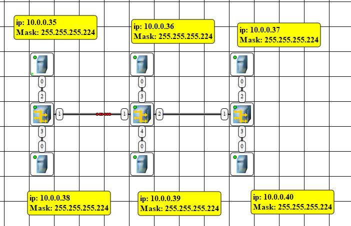
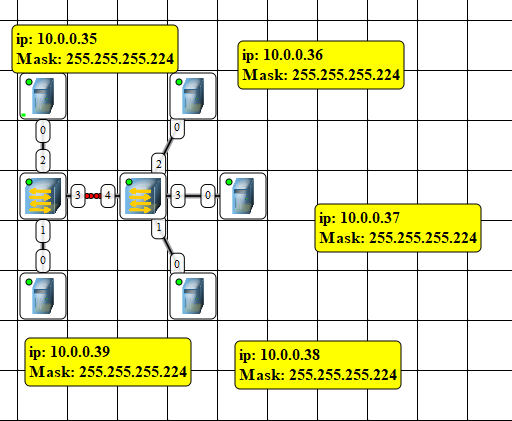

# Лабораторная работа № 5

## Ознакомление с интерфейсом программы. Соединение ЭВМ в сеть

### Цель работы
Познакомится с утилитой WinMTR. Научится использовать  утилиту для оценки качества интернет соединения.

### Теоретическая часть

Для запуска эмулятора NetEmul необходимо либо воспользоваться соответствующим пунктом главного меню операционной системы, либо выполнить в терминале команду netemul.

## Практическая часть

### Соединение двух ЭВМ напрямую

> 

### Построение ЛВС на концентраторах

> 

### Построение ЛВС на коммутаторах

> 

Файл схемы lab5.net лежит рядом, в корне проекта