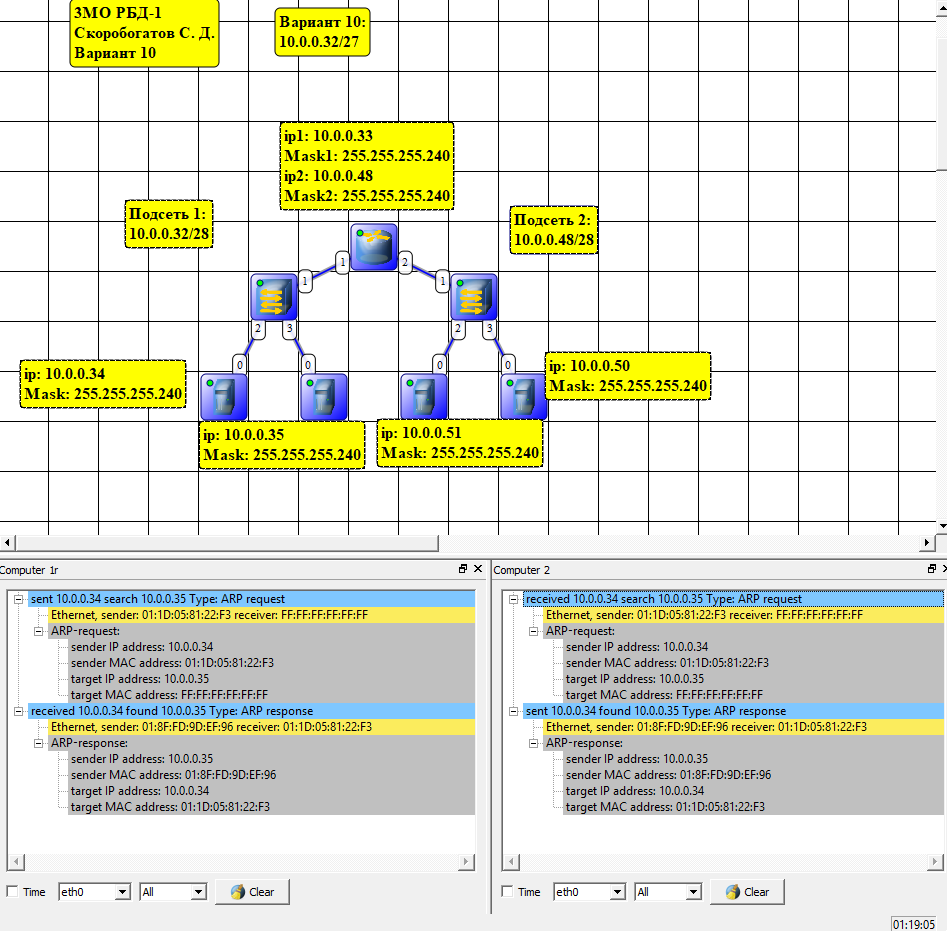
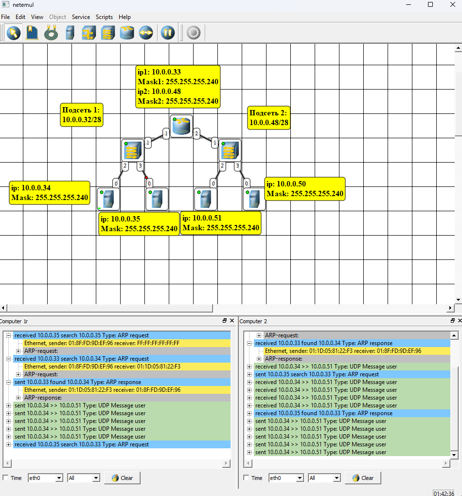

# Лабораторная работа № 6

## Разрешение адресов по протоколу ARP. APR-спуфинг

### Цель работы
Ознакомиться с механизмом работы протокола ARP. Научиться формировать и отправлять пользовательские пакеты. Ознакомиться с журналом работы сетевого устройства в эмуляторе. Научиться проводить сетевую атаку вида ARP-спуфинг.

### Теоретическая часть

ARP (Address Resolution Protocol — протокол определения адреса) — протокол в компьютерных сетях, предназначенный для определения MAC- адреса сетевого устройства по известному IP-адресу. Наибольшее распространение ARP получил благодаря повсеместности сетей IP, построенных поверх Ethernet, поскольку в подавляющем большинстве случаев при таком сочетании используется ARP. 

## Практическая часть

### Определение MAC-адреса с помощью ARP-запроса

> 

### Реализация атаки ARP-спуфинг

> 

### Вывод
Получилось, что ARP-спуфинг работает, а протокол довольно доверчивый. Сеть была поделена на 2, по 16 адресов в каждой из подсетей.

Файл схемы lab6.net лежит рядом, в корне проекта